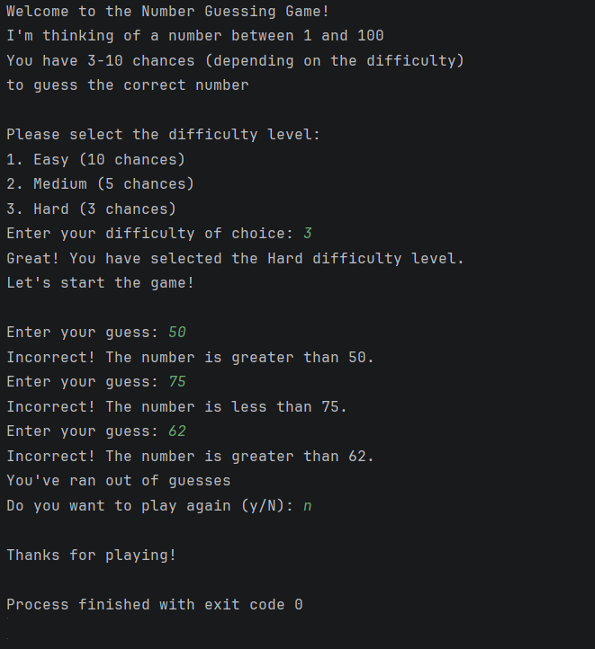

# Number Guessing Game
## You choose the difficulty and guess away!

This is the number guessing game from the [beginner project](https://roadmap.sh/projects/number-guessing-game) 
in this [roadmaps](https://roadmap.sh/) website. I made this to practice using git
commands, learn markdown files, and better understand project structure.
So here's my take at this simple project.

This is how it works:
- You enter the game and there are three difficulty levels
- You have x amount of guesses depending on the difficulty level
- You try to guess the number with the limited attempts you are given
- Your high score is displayed whenever you win
- You have the option to replay

### Sample of a game:


How to play the game:
- Download just the src folder
- Using your terminal, follow this path: /src/main/java/
- Once in the java directory type ```java Game```
- And you'll have the game running!

